# #relational-modeling

#databases 

- management system (min 3 - 4 table)
    - all entities
    - all relationships

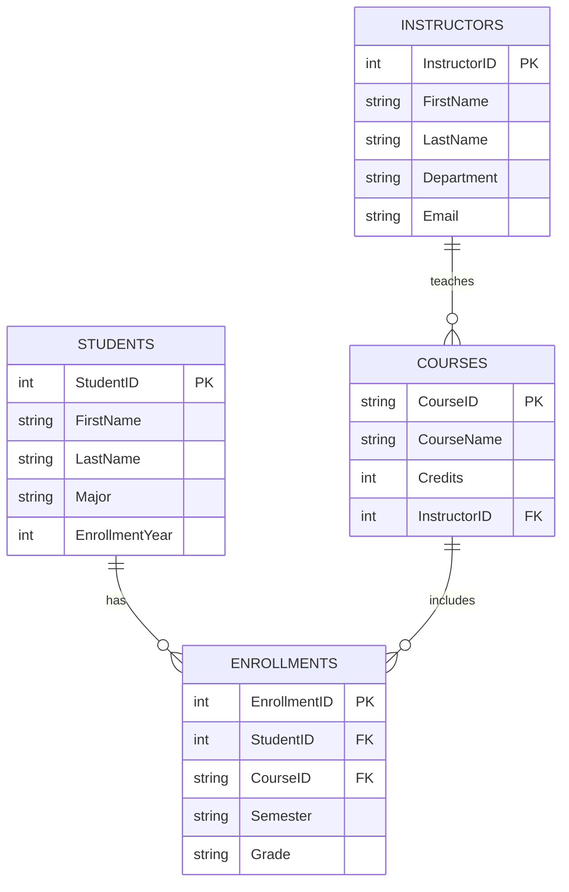

![[management.excalidraw]]

## creating models in oracle sql data modeler

### creating entities

1. download and install `data modeler`
2. create new entity
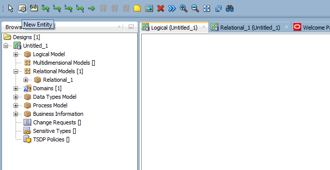
3. add attributes to the entity

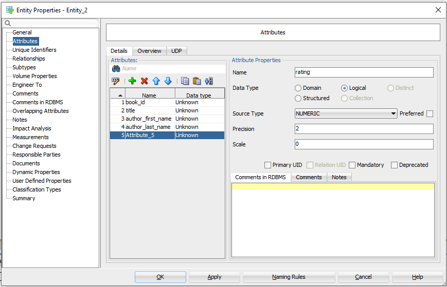

| table | result |
| :--- | :--- |
| 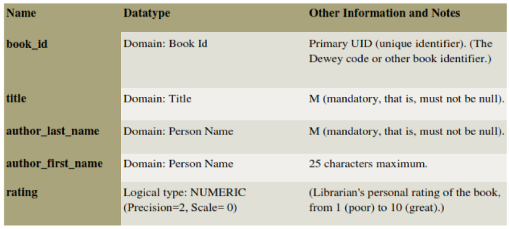 | 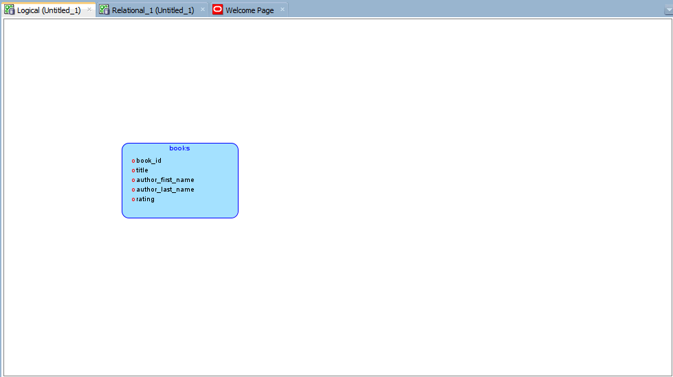 |
| 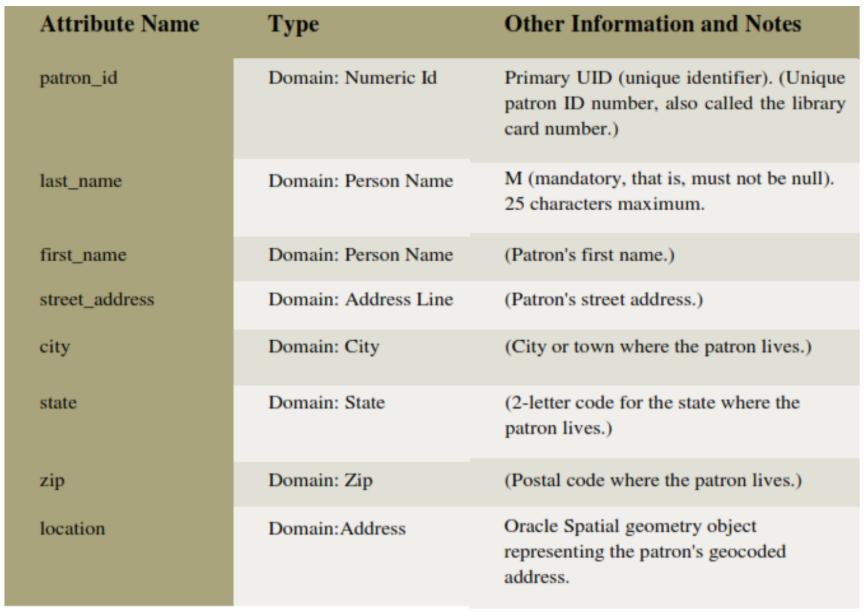 | 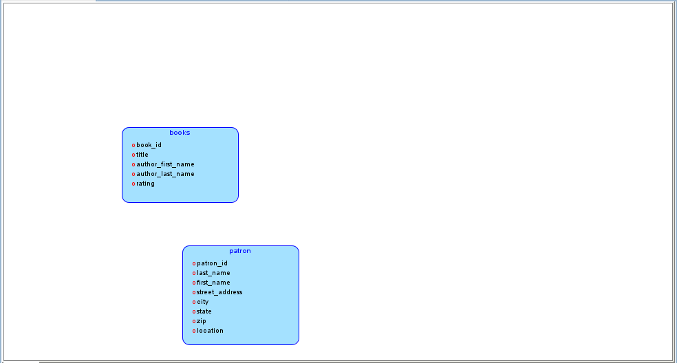 |
| 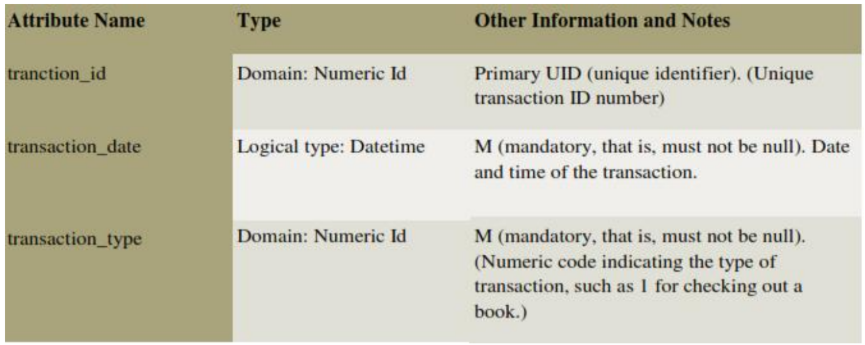 | 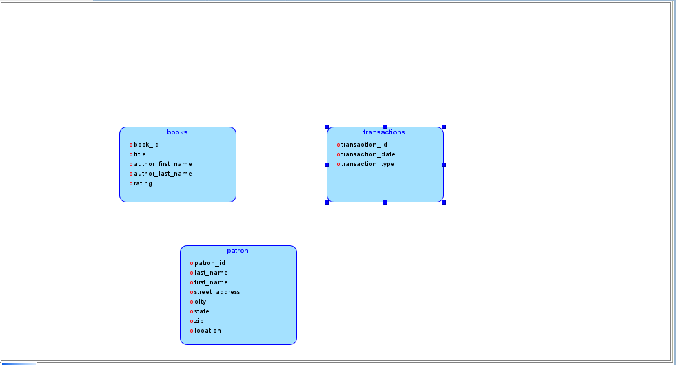 |

### Creating Relations between Entities

- Relations show the relationships between entities- one-to-many, many-to-one, or many-to-many. The following relationships exist between the entities

- *Books and Transactions*
    - **one-to-many**. Each book can be involved in multiple sequential transactions. Each book can have zero or one active checkout transactions; a book that is checked out cannot be checked out again until after it has been returned.
- *Patrons and Transactions*
    - **one-to-many**. Each patron can be involved in multiple sequential and simultaneous transactions. Each patron can check out one or many books in a visit to the library, and can have multiple active check out transactions reflecting several visits; each patron can also return checked out books at any time.

#### creating relations in data modeler

1. Click the New 1- N Relation icon.

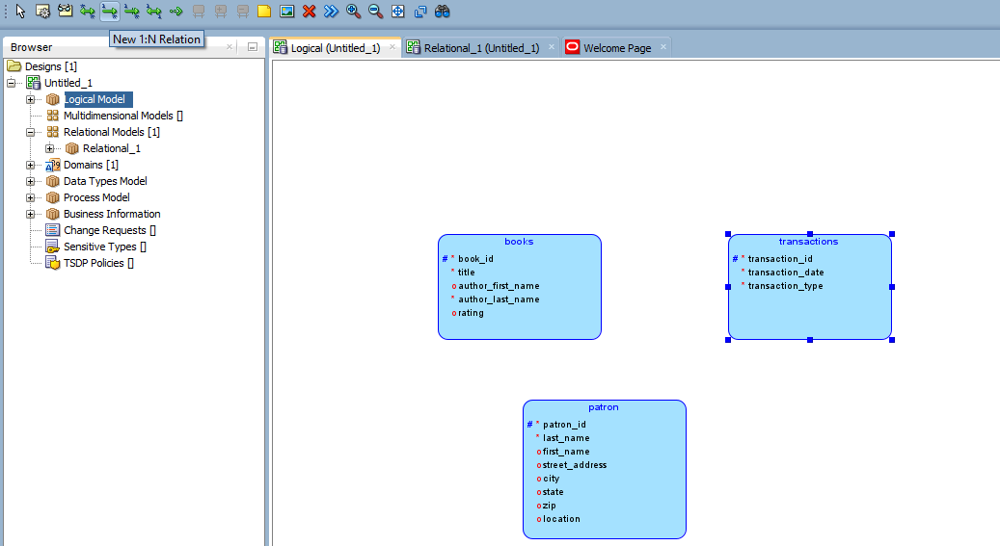

1. Click first in the Books box, then in the Transactions box. A line with an arrowhead is drawn from Books to ransactions.

1. Click the New 1- N Relation icon.
1. Click first in the Patrons box, then in the Transactions box. A line with an arrowhead is drawn from Patrons to Transactions.
1. Optionally, double-click a line (or right-click a line and select Properties) and view the Relation Properties information.

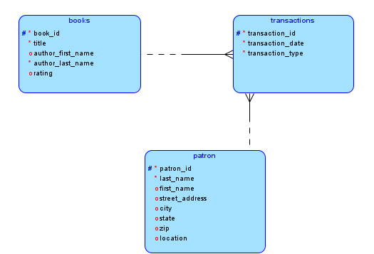
