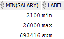

# logical operators

- #filtering #queries
- example : `select * from EMPLOYEES where salary > 10000 and department_id < 50;`
- range: `select * from EMPLOYEES where salary between 5000 and 10000;`
- count: `select COUNT(*) from EMPLOYEES where salary between 5000 and 10000;`
- pattern matching: `select * from EMPLOYEES where hire_date like '%JUN%';` or `'__-JUN-__'`
    - pattern matching with logical operator: `select * from EMPLOYEES where first_name like '%x%' or last_name like '%x%';`
- order: `select * from EMPLOYEES order by salary desc/asc;`
- top 5: `select * from EMPLOYEES where rownum<=5 order by salary desc;`
- aliases and joining: `select length(salary) as lengthSal, salary from employees ;`

```SQL
select Min(salary) , 'min' as label from employees
union
select Max(salary) , 'max' as label from employees
union
select sum(salary) , 'sum' as label from employees;
```

