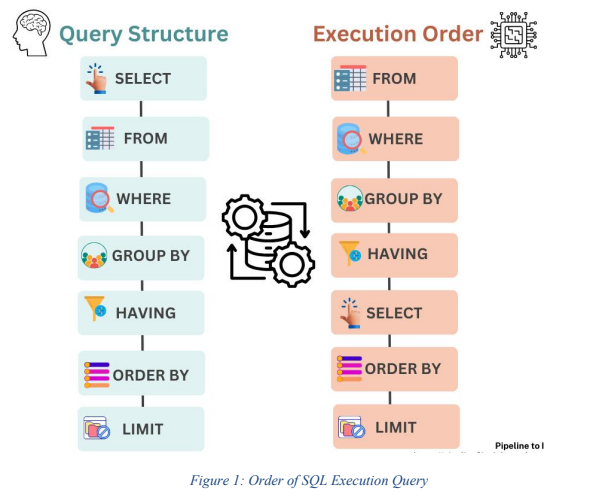
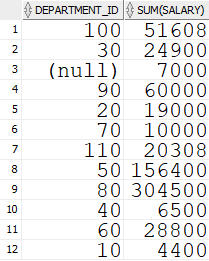
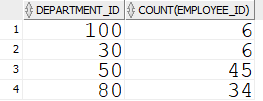

# Aggregate Functions & DML Queries



### **1. Aggregate Functions**

Functions that perform calculations on a set of rows and return a single value.

* **Common Functions**:
* `AVG(col)`: Average of non-null values.
* `COUNT(col)`: Counts rows with non-null values.
* `COUNT(*)`: Counts **all** rows, including NULLs.
* `MIN(col)` / `MAX(col)`: Returns minimum/maximum value.
* `SUM(col)`: Total sum of non-null values.
* **NULL Handling**: Except for `COUNT(*)`, all aggregate functions ignore NULL values.

### **2. The `GROUP BY` Clause**

Used to organize rows into summary groups (e.g., "per department").

* **Syntax**:
```sql
SELECT department_id, SUM(salary)
FROM employees
GROUP BY department_id;
```


* **Crucial Rule**: Any column in the `SELECT` list that is **not** inside an aggregate function **must** appear in the `GROUP BY` clause.


* *Invalid Example*: `SELECT department_id, salary FROM employees GROUP BY department_id;` (Error: `salary` is not aggregated or grouped).

### **3. The `HAVING` Clause**

Used to filter **grouped** results. It is necessary because the `WHERE` clause cannot check aggregate conditions (like "average salary > 5000").

* **Difference from WHERE**:
* `WHERE`: Filters rows **before** grouping.
* `HAVING`: Filters groups **after** grouping.


* **Example** (Find departments with more than 5 employees):
```sql
SELECT department_id, COUNT(employee_id)
FROM employees
GROUP BY department_id
HAVING COUNT(employee_id) > 5; -- Filter applied to the count, not individual rows
```


### **4. SQL Execution Order**

Oracle processes queries in a logical sequence, not the order you write them.

1. **FROM**: Identify tables.
2. **WHERE**: Filter rows.
3. **GROUP BY**: Group the filtered rows.
4. **HAVING**: Filter the groups.
5. **SELECT**: Retrieve columns.
6. **ORDER BY**: Sort final results.

### **5. DML (Data Manipulation Language)**

Commands to manage data within tables.

```sql
CREATE TABLE tasks (
    task_id NUMBER PRIMARY KEY,
    title VARCHAR2(255),
    priority NUMBER(1)
);
```

#### **A. INSERT (Add Data)**

* **Standard Insert**:
```sql
INSERT INTO tasks (task_id, title, priority)
VALUES (123, 'Learn Oracle', 1);
```

* **Insert Multiple Rows (`INSERT ALL`)**:
```sql
INSERT ALL
  INTO tasks (task_id,title, priority) VALUES (2,'Task A', 1)
  INTO tasks (task_id,title, priority) VALUES (3,'Task B', 2)
SELECT * FROM dual;
```
> [!NOTE]
>
> **💡 Why `SELECT * FROM dual`?**
> **1. The Trick for `INSERT ALL**`
> The command `INSERT ALL` requires a source table to select from at the end. Since you are manually typing values (like `'Task A'`) and not actually copying them from a real table, you need a "dummy" source.
> * `SELECT * FROM dual` acts as that dummy source.
> * Because `dual` has exactly **one row**, it forces your `INSERT ALL` command to run **exactly once**, inserting your specific values.
> 
> 
> **2. What is `DUAL`?**
> It is a special system table built into Oracle that contains exactly **one column** and **one row**. It exists solely to satisfy syntax rules when you need to run a `SELECT` (like for math or dates) but don't need a real table.
> * `SELECT 2 + 2 FROM dual;` → Returns `4`
> * `SELECT sysdate FROM dual;` → Returns today's date
> 
>


* **Insert from Another Table (`INSERT INTO ... SELECT`)**:
Copies data from one table to another.
```sql
INSERT INTO tasks (task_id, title)
SELECT 200, email       -- <--- Manually assign ID 200 here
FROM employees 
WHERE employee_id = 101;
```

* **Dynamic Values**: You can use subqueries inside the `VALUES` clause.

#### **B. UPDATE (Modify Data)**

Modifies existing records based on a condition.

* **Syntax**:
```sql
UPDATE employees
SET salary = 25000,
    commission_pct = 0.2
WHERE employee_id = 100;
```

* **Using Functions**: You can use functions like `REPLACE` during updates.
```sql
UPDATE employees
SET email = REPLACE(email, '@old.com', '@new.com');
```
#### **C. DELETE & TRUNCATE (Remove Data)**

* **DELETE**: Removes specific rows based on `WHERE`. Can be rolled back.
```sql
DELETE FROM employees WHERE employee_id = 101;
```

* **TRUNCATE**: Removes **all** rows immediately. It is faster than DELETE but cannot be easily undone (no undo generation for rows).

---

### **Lab Checklist for Practice**

1. **Create** the `TASKS` and `EMPLOYEE` (custom) tables as shown in the manual.
2. **Insert** dummy data using `INSERT ALL` and `INSERT INTO ... SELECT`.
3. **Run** Aggregate queries (`AVG`, `COUNT`) on the HR `EMPLOYEES` table grouped by `DEPARTMENT_ID`.
4. **Apply** a `HAVING` clause to filter those departments.
5. **Update** a record using the `REPLACE` function.
6. **Delete** a row and then **Truncate** your custom table