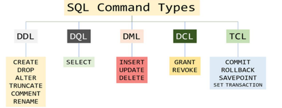
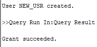
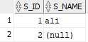

# sql as DDL
## SQL cmd types


- DDL – **D**ata **D**efinition **L**anguage
- DQL – **D**ata **Q**uery **L**anguage
- DML – **D**ata **M**anipulation **L**anguage
- DCL – **D**ata **C**ontrol **L**anguage
- TCL – **T**ransaction **C**ontrol **L**anguage


## datatypes

| Category | Data Type | Description | Example |
| :--- | :--- | :--- | :--- |
| **Numeric** | `INT` | Whole numbers | Employee Age: `25` |
| | `BIGINT` | Very large whole numbers | Population: `9876543210` |
| | `DECIMAL` / `NUMERIC` | Fixed-point (exact precision) | Product Price: `345.25` |
| | `REAL` / `FLOAT` | Floating-point (approximate) | Value of Pi: `3.14159` |
| | `BIT` | Boolean values (0 or 1) | IsActive: `1` (True) |
| **Currency** | `MONEY` | Currency values | Salary: `7500.75` |
| **Date & Time**| `DATE` | Date only | Birthdate: `20-SEP-1999` |
| | `TIME` / `DATETIME` | Time or both Date and Time | Meeting: `2026-01-25 14:30` |
| **Text** | `CHAR(n)` | Fixed-length text | Gender: `'M'` |
| | `VARCHAR(n)` | Variable-length text | Name: `'Hammad'` |
| **Unicode** | `NCHAR(n)` | Fixed-length Unicode text | Grade: `N'Ü'` |
| | `NVARCHAR(n)` | Variable-length Unicode text | Name (Urdu): `N'علی'` |
| **Binary** | `BINARY` / `VARBINARY`| Fixed or variable binary data | Checksum: `0xFA01` |

## creating new user via db

| cmd |result |
| :--- | :--- |
|  |  |
| `grant create session, create table, unlimited tablespace to new_usr`| 
|||
|*above we are creating a new table in the new user*||
|||

## constraints

- PK
- every record must have a unique identifier

| inserting null val | res |
| :--- | :--- |
|  |  |

- adding null check


### constant & constraint definition
- constraint is a rule for accepting inputs,
- invalid input will be rejected

```SQL
CREATE TABLE teachers (
    teacher_id   NUMBER PRIMARY KEY,
    full_name    VARCHAR2(100) NOT NULL,
    subject      VARCHAR2(50),  
    age          int,
  
    campus_location VARCHAR2(20) DEFAULT 'Main Campus',
    
    -- prevents records where campus location is not this
    CONSTRAINT const_campus CHECK (campus_location = 'Main Campus')
);
```

### alter , truncate

| Action | Description | Example SQL Code |
| :--- | :--- | :--- |
| **Modify Column** | Changes data type or Nullability | `ALTER TABLE Table1 MODIFY Column_Name datatype NULL;` |
| **Unique Constraint** | Ensures values in columns are unique | `ALTER TABLE table1 ADD CONSTRAINT const_N UNIQUE (Col1, Col2);` |
| **Primary Key** | Sets a column as the unique identifier | `ALTER TABLE table1 ADD PRIMARY KEY (Column1);` |
| **Foreign Key** | Links to another table for integrity | `ALTER TABLE table1 ADD FOREIGN KEY (Col) REFERENCES table2 (Col);` |
| **Check (Inline)** | Enforces a condition on column values | `ALTER TABLE table1 ADD CHECK (Column_Condition);` |
| **Check (Named)** | Enforces a condition with a specific name | `ALTER TABLE table1 ADD CONSTRAINT Name CHECK (Condition);` |
| **rename** | rename a table |`ALTER TABLE old_table_name RENAME TO new_table_name;`|
