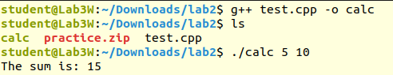
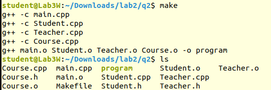

# compiling

- convert code to instructions
- options:
    - preprocessing only:   `-e`
    - compiling upto asm: `-S`
    -  "        "    obj: `-c`

- default output: `./.a.out`


- `int main(int argc, char *arg[])`
    - argc: arg count
    - arg[]: arr of args
- for taking inputs directly from terminal
- `./a.out 1 22`
    - argc = 3
    - arg[0]: `./a.out`
    - arg[1]: `1`
    - arg[2]: `2`
- NOTE: they must be converted to integers using atoi().

- example use

```cpp
#include <iostream>
#include <cstdlib> // Required for atoi
using namespace std;
int main(int argc, char *arg[]) {
if (argc < 3) {
cout << "Error: Please provide two numbers." << endl;
return 1;
}
int sum = atoi(arg[1]) + atoi(arg[2]);
cout << "The sum is: " << sum << endl;
return 0;
}
```



# Makefiles

- enables seperate compilation
- define dependencies b/w project files
- **automates** build process using make utility

## auto var in makefile
- eval.o : eval.c eval.h

| Variable| Meaning|
|-|-|
| $@| Target name (eval.o)|
| $<| First dependency (eval.c)|
| $^| All dependencies (eval.c eval.h)|
| $?| Dependencies newer than target|


- make file content is same for all files, only change is in file name

```make
CC = gcc # compiler
CFLAGS = -I. # cflags to be implemented
DEPS = hellomake.h # all header files defined
OBJ = hellomake.o hellofunc.o 
%.o: %.c $(DEPS) 
$(CC) -c -o $@ $< $(CFLAGS) #
hellomake: $(OBJ)
$(CC) -o $@ $^ $(CFLAGS)
```

## example make file


```make
all: program

program: main.o Student.o Teacher.o Course.o
	g++ main.o Student.o Teacher.o Course.o -o program
main.o: main.cpp
	g++ -c main.cpp
Student.o: Student.cpp Student.h
	g++ -c Student.cpp
Teacher.o: Teacher.cpp Teacher.h
	g++ -c Teacher.cpp
Course.o: Course.cpp Course.h
	g++ -c Course.cpp
clean:
	rm -f *.o program
```

WARNING: make file is tab sensitive, and LINUX IS CASE SENSITIVE
